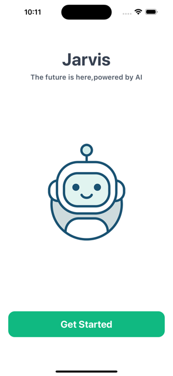
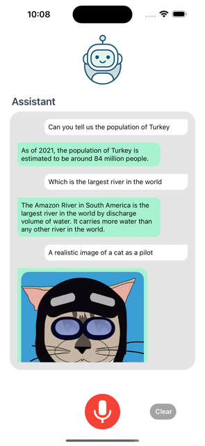
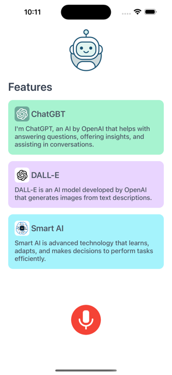

# ChatGPT React Native App

## Project Description

This project is a mobile application built with React Native that integrates the OpenAI GPT-3.5 API to generate text responses. It also features text-to-speech functionality using react-native-tts and styling with NativeWind.

## Video gif


## Welcome Screen



## Home Screen



## Featured Component



## Features

- Real-time AI conversation using OpenAI's GPT API.
- User-friendly interface built with React Native.
- Speech-to-text support for hands-free interaction (using react-native-voice).
- Image generation feature using DALL-E integration.
- Custom error handling and state management for a seamless experience.

## Technologies and Lİbraries Used

- React Native: Framework for building cross-platform mobile apps.
- OpenAI GPT-3 API: Provides the AI chatbot experience.
- Axios: For making API requests.
- React Native Voice: Used for speech-to-text functionality.
- DALL-E: AI image generation (optional feature).
- Hermes: JavaScript engine for React Native (optional).
- Metro: Development server for React Native.
- NativeWind: For styling the application.

## Requirements

To run this project locally, you will need:

- Node.js
- React Native CLI
- OpenAI API Key

## Installation

- Clone the project to your local machine:
  git clone https://github.com/ozerbaykal/React_Native_IA.git

- Navigate to the project directory:

```
cd React_Native_IA
```

- Add your OpenAI API key in the constants file:

```
const apiKey = 'YOUR_API_KEY';
```

# Getting Started

> **Note**: Make sure you have completed the [React Native - Environment Setup](https://reactnative.dev/docs/environment-setup) instructions till "Creating a new application" step, before proceeding.

## Step 1: Start the Metro Server

First, you will need to start **Metro**, the JavaScript _bundler_ that ships _with_ React Native.

To start Metro, run the following command from the _root_ of your React Native project:

```bash
# using npm
npm start

# OR using Yarn
yarn start
```

## Step 2: Start your Application

Let Metro Bundler run in its _own_ terminal. Open a _new_ terminal from the _root_ of your React Native project. Run the following command to start your _Android_ or _iOS_ app:

### For Android

```bash
# using npm
npm run android

# OR using Yarn
yarn android
```

### For iOS

```bash
# using npm
npm run ios

# OR using Yarn
yarn ios
```

If everything is set up _correctly_, you should see your new app running in your _Android Emulator_ or _iOS Simulator_ shortly provided you have set up your emulator/simulator correctly.

This is one way to run your app — you can also run it directly from within Android Studio and Xcode respectively.

## Step 3: Modifying your App

Now that you have successfully run the app, let's modify it.

1. Open `App.tsx` in your text editor of choice and edit some lines.
2. For **Android**: Press the <kbd>R</kbd> key twice or select **"Reload"** from the **Developer Menu** (<kbd>Ctrl</kbd> + <kbd>M</kbd> (on Window and Linux) or <kbd>Cmd ⌘</kbd> + <kbd>M</kbd> (on macOS)) to see your changes!

   For **iOS**: Hit <kbd>Cmd ⌘</kbd> + <kbd>R</kbd> in your iOS Simulator to reload the app and see your changes!

## Congratulations! :tada:

You've successfully run and modified your React Native App. :partying_face:

### Use an Android or iOS emulator.

- Use an Android or iOS emulator.
- Alternatively, scan the QR code with your physical device using the Expo Go app.

<h2>Contributing</h2>

Contributions are welcome! Please open an issue first to discuss what you would like to change.

- 1.Fork the project
- 2.Create your feature branch (git checkout -b feature/NewFeature)
- 3.Commit your changes (git commit -m 'Add new feature')
- 4.Push to the branch (git push origin feature/NewFeature)
- 5.Open a Pull Request

<h2>Contact</h2>

Özer BAYKAL mail : baykalozer87@gmail.com

Project Link: https://github.com/ozerbaykal/React_Native_IA
